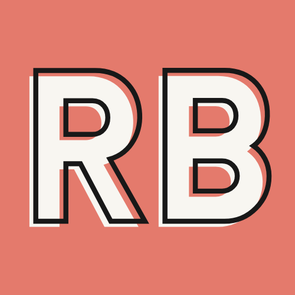

  

<h1 align="center">
  ✨ Portfolio 2.0 ✨ 
</h1>

  
  
  
  

## Allow Me to Reintroduce Myself
This project is the second iteration of my online portfolio. This time around, I wanted to venture into the New Modern Web by utilizing JAMstack architecture, the GatsbyJS ecosystem as well as CSS in JS with Styled Components. 

In the end, I found that I was left with an incredibly fast and reliable site with improved scalability and security. It was a great first foray into the JAMstack workflow and I'm excited to dive deeper and build more things.

## Tech Stack

- [React](https://reactjs.org/)
- [GatsbyJS](https://www.gatsbyjs.com/)
- [Styled-Components](https://styled-components.com/)
- [Contentful](https://www.contentful.com/)
- [Netlify](https://www.netlify.com/)

## Next Steps

Now that basic functionality is complete, I'm working towards taking the project to the next level by adding:

- [x] Toggle for dark mode
- [ ] Testing with Jest
- [ ] Offline functionality

## Author
[@rchlblns](https://github.com/rchlblns)

## License
[MIT](https://choosealicense.com/licenses/mit/)
